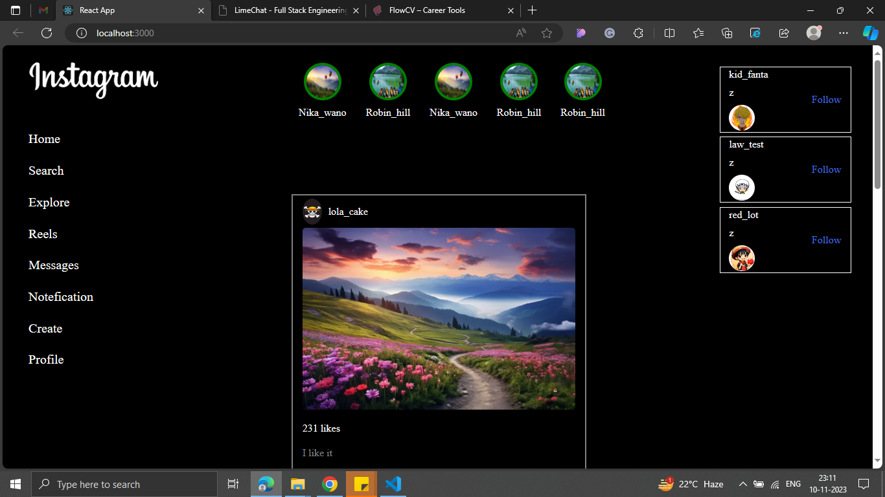

# instagram-clone

## Project Overview

This project is a React.js front-end implementation of an Instagram clone. It aims to replicate the core features and user interface of the popular photo-sharing platform Instagram.

## Table of Contents
- [Screenshot](#UserInterfase)
- [Features](#features)
- [Installation](#installation)
- [Dependencies](#dependencies)
- [Contributing](#contributing)

## Screenshot




## Features

1. **User Authentication:**
   - Users can sign up and log in.

2. **Profile:**
   - User profiles showcase their posts, followers, and following.

## Installation

1. Clone the repository:

   ```bash
   git clone https://github.com/your-username/instagram-clone.git
   ```

2. Change into the project directory:

   ```bash
   cd instagram-clone-react
   ```

3. Install dependencies:

   ```bash
   npm install
   ```

## Usage

1. Start the development server:

   ```bash
   npm start
   ```

2. Open your browser and navigate to [http://localhost:3000](http://localhost:3000).

## Dependencies

- [React](https://reactjs.org/)
- [Material-UI](https://material-ui.com/)

For a complete list of dependencies, refer to the `package.json` file.

## Contributing

Contributions are welcome! Please follow the [contribution guidelines](CONTRIBUTING.md).
